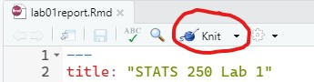

```{r setup, include=FALSE}
knitr::opts_chunk$set(echo = TRUE)
```

## Learning Objectives

### Statistical Learning Objectives
1. Understand the structure of data (observations and variables)
2. Think about the scope of a data set: what questions can and cannot be answered with a particular data set?

### R Learning Objectives
1. Learn how to "assign" information to "objects" in R
2. See how R "reads in" a data set from a file
3. Be able to identify the names of variables contained in a data set
4. Make a frequency table for one or two variables

### Functions and syntax covered in this lab
1. `read.csv()`
2. `<-`
3. `names()`
4. `str()`
5. `dim`
6. `table()`

### Weekly Advice
When learning how to use a new program like R, the best advice we can give you is to **try things**. The worst thing that can happen is that you get an error that you can learn from. The way to learn things in this context is to play around, have fun, and **make mistakes**. 

<hr />

## Lab Tutorial

### "Assignment" in R
Remember how we can use R as a calculator?
```{r calcExample}
36 / 6
```
What if we want R to remember the result of our calculation? We can give the result a name by **assigning** it to something.

```{r assignment1}
x <- 36 /6  
```
We read that code as "x *gets* 36 / 6". The arrow is made using the less-than symbol (`<`, shift + comma on a US English keyboard) and a hyphen.

Now, we've stored the result as `x`, and R will remember that `x` is 6. You can see in the environment pane in R Studio (top right) that there's now a "value" called `x` and it's 6. You can also access the value of `x` by typing `x` into R. Check it out:
```{r x}
x
```
**NOTE:** R is "case-sensitive", which means that upper-case letters are *different than* lower-case letters. Notice what happens when we ask R for the value of `X`:
```{r X, error = T}
X
```
R doesn't like this! Notice that there's an error that says `object 'X' not found`. This means that R doesn't know about something called `X` (upper-case X), because we haven't assigned anything to `X`. **Be careful about upper and lower case letters in R!** (Also, notice that we made a mistake here, and nothing bad happened! R told us we were wrong and got a little angry, but that's okay, because R is a computer program and doesn't actually have feelings).

### Reading in Data

We can also *assign* data to names in R. Remember last week? We ran this code:

```{r lastWeekData}
penguins <- read.csv(url("https://raw.githubusercontent.com/STATS250SBI/palmerpenguins/master/inst/extdata/penguins_NArm.csv"))
```

Here, we stored the result of `read.csv()` as an object called `penguins`. `penguins` is what's called a "data frame" in R (in lecture, you might hear it called a "data matrix" or "data set"). So, now when we want to use the data, we can just tell R about `penguins` instead of having to write that whole `read.csv()` line again and again.

Now, when you look in the environment pane of R Studio (the "Environment" tab in the R Workspace, the top right pane), you'll see a "data" object called "penguins" -- this is our data frame!


#### What's a CSV file?
CSV stands for "comma separated values" and is a commonly used file type for storing data. Here's a sample of what a .csv file looks like:
```{r whatsaCSV}
write.csv(head(penguins))
```
Each row of the file (when you knit this document, rows are denoted by ## in the output, but ## is not in the actual file) is an "observation" or "case", and consists of one or more variables whose *values* are *separated* by *commas* (hey, look at that). The first row contains the variable names. You don't need to know these specific details, but it will be helpful to understand what a .csv file is for these labs.

When you use the function `read.csv()`, R expects you to tell it where a .csv file is (notice that the name of the function matches the file type -- .csv!). So, inside those parentheses, you can give R a file location or a URL that tells it about a .csv file.

**Try it:** Visit the URL (Web address) inside of `read.csv()` above by copying and pasting it into your browser -- what do you see? 


### Exploring Data "Structure"

So now that we've got a data frame loaded into R, let's see what's in it. We got a preview of this last week, but let's more officially explore it.

Remember from last lab that we can see the first 6 rows of the data by using a function called `head()`:

```{r head}
head(penguins)
```

What if we just wanted to know the names of the variables that are contained in `penguins`? We can use the `names()` function:

```{r names}
names(penguins)
```

This can be useful to remind ourselves of how the variable names are spelled/formatted in R. Remember how R is case sensitive? It's important to format these variable names *exactly*, because R isn't as smart as you are and so you need to tell it *exactly* what to do.

Something to notice about the variable names above is that words are separated by underscores (`_`) -- this is because R *does not like spaces* in variable names. When giving things names in R, you can only use a combination of letters, numbers, periods, and underscores, and the names have to start with a letter or a period. People tend to use underscores or periods instead of spaces.

Watch what happens when you try to assign something to a "bad" name:
```{r badName1, error = T}
tik tok <- 12
```

```{r badName2, error = T}
4eva <- 4 * 2 
```

```{r badName3, error = T}
_hi_mom <- 5^2
```

The errors saying "unexpected symbols" or "unexpected input" are R's way of telling you that these names are not allowed, and that you should use a different name. Here's how we'd correct these:
```{r goodNames}
tiktok <- 12
forever <- 4 * 2
dear_mother <- 5^2
```

Let's now explore the "structure" of the data (similar to what we did with 'head()', but with a twist). To see a data frame's *structure*, we can use the function `str()` (pronounced "stir"):
```{r str}
str(penguins)
```
This tells you the number of rows ("observations"), the number of columns ("variables"), the names of the variables, what type of variable it is, and gives you a preview of what the variables look like. The variable "type" (`chr`, `num`, `int`) is useful for R, but you don't have to know much about it at this point. It's not part of the data.

If you really only want the "dimension" of the data frame (i.e., how many rows and how many columns), you can use the `dim()` function:
```{r dim}
dim(penguins)
```

The results are given in the order "rows, columns" because data is **R**eally **C**ool (rows, columns).

### Frequency Tables

Remember when we made this bar chart last week?

```{r speciesPlot}
barplot(table(penguins$species),
     xlab = "Species",
     ylab = "Frequency",
     main = "Bar Chart of Number of Penguins of Each Species Observed",
     col = c("darkorange1", "mediumorchid2", "darkcyan"))
```

In order to make this plot, we had to give R a "frequency table" of the variable `species`. This is a way to count how many observations (rows) there are that correspond to each value of `species`. To make a frequency table, we use the `table()` function:

```{r table}
table(penguins$species)
```

So, there are 119 Gentoo penguins in the data. 

Notice that inside the table function, we have something that looks a little weird. We wrote `penguins$species`. This is how we tell R to use the `species` variable *inside the data frame* `penguins`. The dollar sign ($) tells R to look inside the data frame `penguins` for the column called `species`. 

It's very important that you tell R *which data frame* the variable you're interested in is from. Let's see what happens when we don't:
```{r noDollarSign, error = T}
species
```
Because we don't have anything called `species` in our environment (there's nothing called `species` in the environment pane), R doesn't know what we're talking about! `species` only exists inside of `penguins`.

We can also make "two-way" frequency tables (sometimes called "contingency tables") to summarize counts for two categorical variables:
```{r twoWayTable}
table(penguins$species, penguins$island)
```

So it looks like all the Gentoo penguins in our data live on Biscoe island.

Remember that data is **r**eally **c**ool, so the first variable you give to `table()` is in the **r**ows of the table, and the second is in the **c**olumns.

Notice that we separated the two variables inside of `table()` with a comma -- it's important to remember this!

<hr />

## Try It!
Depending on your instruction method (in person, synchronous remote, asynchronous remote), complete the following exercises collaboratively. 

1. **In person:** Form groups of 2-4 with those around you (maintaining physical distance). Your instructor will provide additional details.
2. **Synchronous remote:** You will be placed in a Zoom breakout room to work together in small groups. 
3. **Asynchronous remote:** Collaborate with your peers on Piazza.

In this Try It, we'll be using a data set we'll call `a2trees` that contains information about a subset of the top 9 types of trees planted around Ann Arbor in 2009. The city maintains an interactive map of all such trees at [this link](https://gisappsecure.ewashtenaw.org/Html5Viewer_2_11/index.html?viewer=A2Trees.A2Trees) -- you should check it out. They're updating the database this year, too!

> **1.** We'll start by reading in the data. The data are stored in a file called `a2trees_clean.csv`. We give the name of this file (*in quotes!*) to the `read.csv()` function. Modify the code below to call the data set `a2trees`. 

*Answer:* 

```{r a2trees, error = T}
d <- read.csv("a2trees_clean.csv")
```

> **2.** How many variables are in `a2trees`? How many cases are there? Using code, find the names of the variables in the data set.

*Answer:* 

```{r a2trees_size, error = T}
# Replace this comment with code required for Try It 2. (Remember that this text is a comment, so R ignores it; you can delete it if you want.)
```

Replace this text with the number of variables and number of cases in `a2trees` (your answer to Try It 2).

> **3.** Make a table of the variable in `a2trees` which represents a tree's health. How many trees in the data set are in very good health? What do you notice about the *order* in which R presents the categories?

*Answer:* 

```{r a2trees_healthTable, error = T}
# Replace this comment with code required for Try It 3. (Remember that this text is a comment, so R ignores it; you can delete it if you want.)
```

Replace this text with your answers to the questions.

> **4.** Make a bar graph of the variable you tablulated in Try It 3. You can use the code from the first chunk in the Frequency Tables section as a starting point. *Be sure to change the axis labels and title!*
If you have time, play around with the colors! (things like "red", "yellow", "blue" work, but see [here](http://www.stat.columbia.edu/~tzheng/files/Rcolor.pdf) for a list of possible color names in R if you're more adventurous.)

*Answer:* 

```{r healthPlot}
# Get started by copying and pasting the code from the speciesPlot chunk above! (Remember that this text is a comment, so R ignores it; you can delete it if you want.)
```

> **5.** Make a two-way contingency table for tree health and common genus.

*Answer:* 

```{r billSummaries}
# Replace this comment with code required for Try It 5. (Remember that this text is a comment, so R ignores it; you can delete it if you want.)
```

> **6.** Based on the data, what is the botanical genus (biological classification) of maple trees?

*Answer:* 

```{r mapleGenus, error = T}
# Replace this comment with any code you need to answer the question
```

Replace this text with your written answer to the question.


## Dive Deeper
In the Try It, you played around a little with data about trees in Ann Arbor. Now, we're going to have you dive a little deeper. *Often, there will not be right or wrong answers here, just like in real-life applications of statistics. These questions are meant to make you think more deeply about what you've just done.*

> **1.** [Look at the map](https://gisappsecure.ewashtenaw.org/Html5Viewer_2_11/index.html?viewer=A2Trees.A2Trees) of where the trees in the data set are located. The trees included in the city's data are green dots. In the lower left, you'll see this icon: . Click it to open a widget that will display the latitude and longitude of the place under your cursor. Zoom in, scroll around, and find the Diag (Lat 42.277 N, Lon 83.738 W). *What do you notice about the location of the trees in the data set? Are there trees you know of that aren't included?* ([For those of you not on campus, here's a picture of the Diag in the fall. It may be helpful here.](http://sustainability.umich.edu/media/images/diag-aerial.jpg)).

Replace this text with your written answer to the question.

> **2.** Based on your answer to #1 above, speculate on who collected these data. Explain your thinking in 1-2 sentences.

*Replace this text with your written answer to the question.*

> **3.** Make a frequency table of the common genus of the trees in the data. Based on your answer to Try It #5 (the two-way frequency table), what proportion of elm trees are in good health?

```{r commonGenusTable, error = T}
# Replace this comment with any code you might need to answer the question
```

*Write your answer here*


> **4.** Could this data set be used to answer the research question *"Are there more maple or oak trees in Nichols Arboretum[^1]"*? Why or why not? 

*Write 1-2 sentences about your answer here*

[^1]: "The Arb" is a University-owned nature area, and if you're on campus it's a great place for a peaceful, socially-distanced walk!

> **5.** Could this data set be used to answer the research question *"What is the average height of trees on public land designated as 'landmark trees' in Ann Arbor"*? Why or why not? 

*Write 1-2 sentences about your answer here*

## Wrap-Up and Submission

At the top of the document, make sure you've changed the `author` field to your name (in quotes!). If you'd like, change the date as well.

When you've finished the lab, click the **Knit** button one last time.<br />


### Submission instructions
<!-- This is a comment and will not show up in your document. Note that the
numbering here is all 1's. This will automatically be converted to 1, 2, etc.
when you knit the document; writing all 1's makes it so you don't have to 
constantly update the numbering when you move things around in editing! -->

#### If you're using RStudio Cloud
1. In the Files pane, check the box next to `lab01report.html`: </br>

2. Click More > Export... </br>

3. Click Download and save the file on your computer. </br>


#### If you're RStudio installed on your computer
1. locate the `lab01report.html` file on your computer. The file will be saved in the location indicated at the top of the files pane. <br>


#### Submission to Canvas

1. Click the "Assignments" panel on the left side of the page. Scroll to find "Lab 1", and open the assignment. Click "Submit Assignment". <br />


2. Towards the bottom of the page, you'll be able to choose `lab01report.html` from the folder you saved it in from RStudio Cloud or noted if you're using RStudio Desktop. **You will only be able to upload a .html file -- do not upload any other file type.** <br />

3. Click "Submit Assignment". You're done! 
